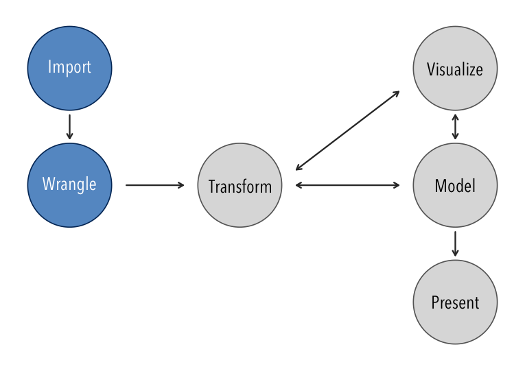
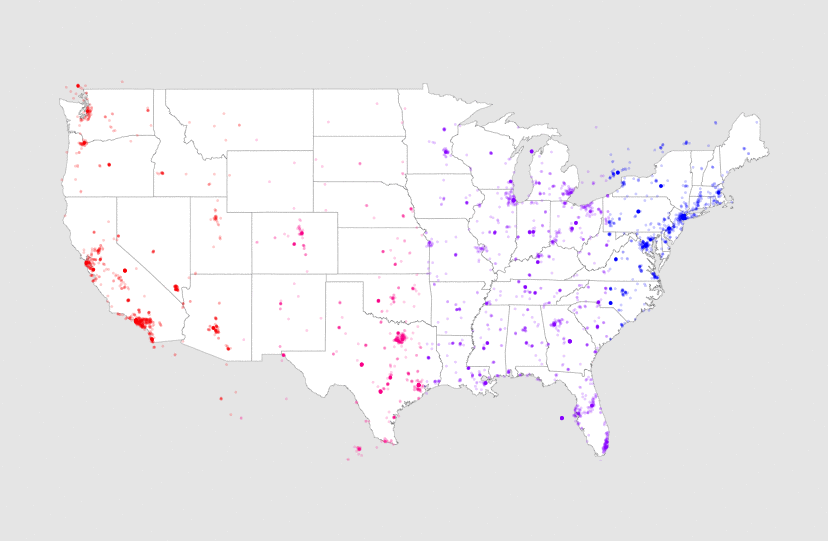
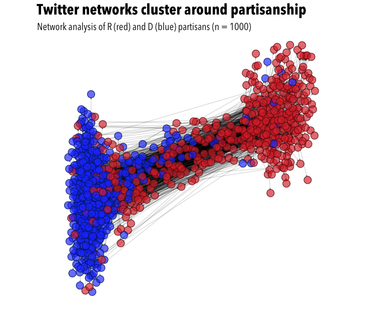
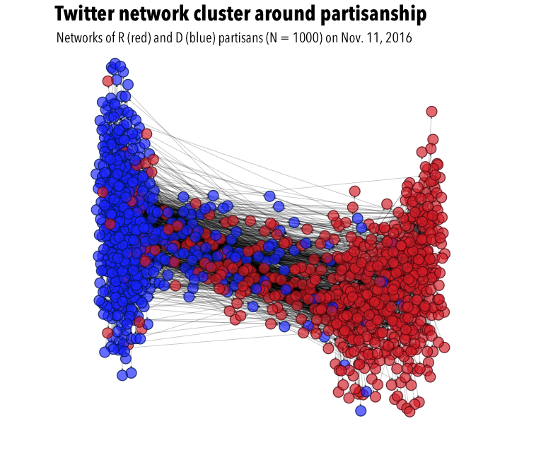

## Communication Research
- Current issues in quantitative research
  - Limitations
  - Future challenges
- Technological advances in quantitative research
  - Digital sources of [big] data
  - Data science

--- .transition

## &nbsp;

<h1 class="mytransition">There is no evidence that 3-5 million illegal
votes were cast in the 2016 U.S. election.</h1>

--- .transition

## &nbsp;

<h1 class="mytransition">Quantitative communication research is not perfect.</h1>

---

## Issues in COMS research

- Generalizability of student samples
- Attrition in panel studies
- Real-time/tracking data is expensive
- Measurement error in self-report/questionnaire data

---

## New challenges

- Fragmented media audiences and probability sampling
- Respondent fatigue/information overload
- Increasingly salient privacy concerns

--- .transition

## &nbsp;

<h1 class="mytransition">"The replication crisis" will inevitably
include communication studies.</h1>

---

## Replication crisis
- Recent term used to describe the inability to replicate research
  findings.
- Originates in psychology research, but applies to all social science
  research.

- Psychology

--- .transition

## &nbsp;

<h1 class="mytransition">Data science is a thing.</h1>

---

## Defining data science
- Data science is a hybrid of quantitative statistics and computer science.

--- .transition

## &nbsp;

<h1 class="mytransition">Communication research could benefit from
data science.</h1>

---

## Quantitative Research

---

## Data Science Workflow

--- .transition

## &nbsp;

<h1 class="mytransition">Data science will influence future
communication research.</h1>

---

## Samples

- Convenience samples of students tend to be homogenous and
  limited in size
- Digital sources are not restricted by geography and can be massive
- In a few hours, one could, for example, stream a million tweets
  from the U.S.

--- .dark

## &nbsp;

--- .dark3

## &nbsp;

--- .sentanalysis

## &nbsp;

--- .netanalysis

## &nbsp;

--- .netanalysis

## &nbsp;

--- .netanalysis

## &nbsp;

--- .sentanalysis

## &nbsp;

--- .sentanalysis

## &nbsp;

---

## New media environment
- Media fragmentation poses several problems
	- User-level agenda setting lacks regulation (Garrett, 2013) e.g., "fake news" (Stanford History Education Group, 2016),
      and new currency is social validation (Messing & Westwood, 2012)
- Concerns compounded by methodological problems
	- Sampling, reliability, and elusive promise of "big data" (Garrett, 2013)

---

## Partisan networks
- We know a lot about exposure to partisan news
    - e.g., theories of motivated reasoning and cognitive dissonance
      (Prior, 2013)
- We know relatively little about partisan [user] networks
	- We lack necessary tools to examine networks and interactions on
      a large scale (Garrett, 2013)
	- This was my motivation for writing *rtweet* an R package for
      collecting Twitter data (Kearney, 2016)

---

## &nbsp;

--- .transition

## &nbsp;

<h1 class="mytransition">Where I am</h1>

---

## Selective exposure on Twitter
- Asymmetrical connections make Twitter unique
  - Estimate political ideology using user networks (Barbera, 2015)
- My dissertation
  - I tracked networks from a random sample of Twitter users during
    the 2016 election

---

## Change in polarization (H2)
- If partisan politics amplifies partisanship, then
  network polarization should increase as the  election gets closer
- My dissertation compares *within*-user change *between*
  partisan and non-partisan groups over time using multilevel modeling

--- .transition

## &nbsp;

<h1 class="mytransition">H2 results</h1>

--- .results

## Network polarization

--- .results

## Network polarization (weighted)

--- .transition

## &nbsp;

<h1 class="mytransition">That's it \o/  Thanks!</h1>

---

## Defs

Large and unstructured data impose challenges not historically
addressed by statistics (Vasant, 2013)

Machine learning is center to data science (Vasant, 2013)

---

## stats

- Statistics, more so than computer science, is condusive to knowledge
  discovery (Vasant, 2013)
	- Computer science provides tools for summarizing and subsetting
      "databases"
	- Statistics provides tools for testing and creating theories
      with "data frames"

---

## Two extremes

**Computer science** examines whether a certain pattern can be found
  in data.
  - *e.g., hey Alexa, what is the capital of Chile?*

**Statistics** examines whether data can be found in a certain
  pattern.
  - *e.g., lack of sleep correlates with decreased cognitive
    performance*

---

## Predictions

Machine learning models are judged by accuracy of their predictions

Predictive models so not attempt to *explain* what's happening
	- Impossible to know whether variables in model actually reflect
      some underlying construct (Vasant, 2013)

Data science is increasingly concerned with making predictions

---

## Data science

- Data science is "a set of fundamental principles that  support  and
  guide  the  principled  extraction  of  information  and  knowledge
  from  data" (Provost & Fawcett, 2013, p. 52)

- Big data refers to "datasets  that  are  too  large  for
  traditional data-processing systems and that therefore require new
  echnologies" (Provost & Fawcett, 2013, p. 54)

---

## References

Vasant, D. (2013). Data science and prediction. *Communications
of the ACM, 56*, 64-73.

Provost, F., & Fawcett, T. (2013). Data science and its relationship to big data and data-driven decision making. *Big Data, 1*, 51-59.
