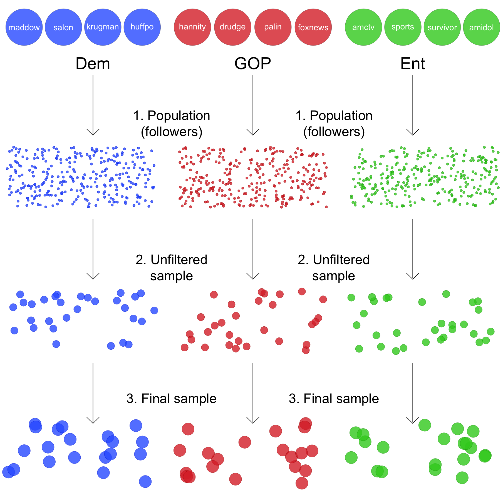
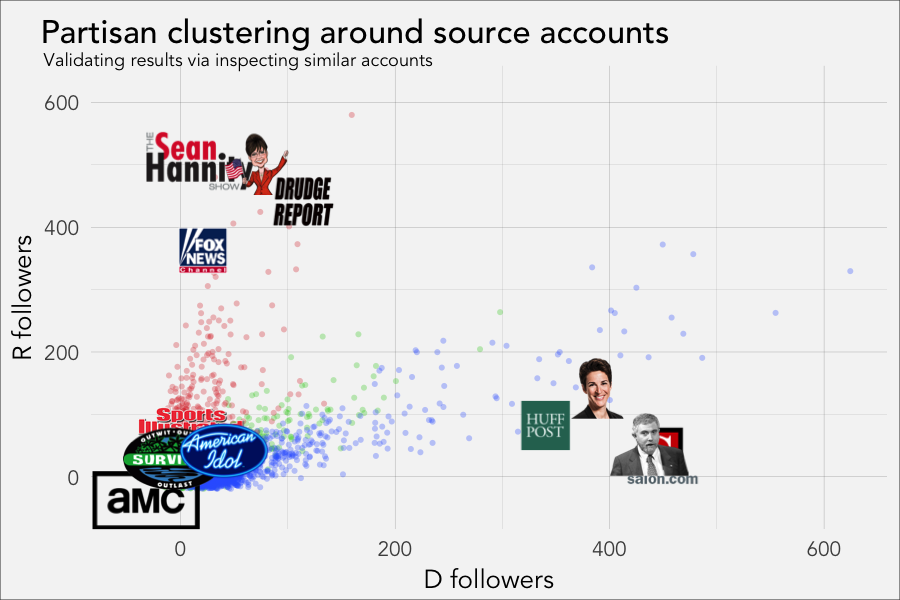
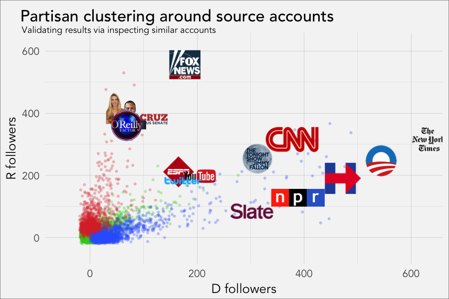

## My research program

&nbsp;

- Relationship between *new* media and *news* media
&nbsp;

- Civic engagement and political polarization
&nbsp;

- Quantitative research methods and data science
&nbsp;

--- .transition

## &nbsp;

<h1 class="mytransition">Where I've been</h1>

---

## Publications
- Political use of social media
	- Latent variable analysis of political interactions on Facebook
      (*Communication Research Reports*, 2017)
	- Field experiment examining effect of following candidates [on
      Facebook] on civic engagement (co-author, *Computers in
      Human Behavior*, 2015)
- Quantitative methods in communication research
	- Reviews of categorical  (*Sage Encylopedia*)
	  , longitudinal (*Sage Encylopedia*)
	  , and new media-leveraging methods (*Handbook of Political Advertising*, 2016)

---

## Partisan media
- Media fragmentation poses several problems
	- User-level agenda setting lacks regulation (Garrett, 2013) e.g., fake news (Stanford History Education Group, 2016),
      and new currency is social validation (Messing & Westwood, 2012)
	- Digital partisans in social media echo chambers (Barbera, et al., 2015; Himelboim, Smith, &
      Schneiderman, 2013)
- Concerns compounded by methodological problems
	- Sampling, reliability, and elusive promise of "big data" (Garrett, 2013)

---

## Partisan networks
- We know a lot about exposure to partisan news
    - e.g., theories of motivated reasoning and cognitive dissonance
      (Prior, 2013)
- We know relatively little about partisan [user] networks
	- We lack necessary tools to examine networks and interactions on
      a large scale (Garrett, 2013)
	- This was my motivation for writing *rtweet* an R package for
      collecting Twitter data (Kearney, 2016)

---

## &nbsp;

--- .transition

## &nbsp;

<h1 class="mytransition">Where I am</h1>

---

## Selective exposure on Twitter
- Asymmetrical connections make Twitter unique
  - Estimate political ideology using user networks (Barbera, 2015)
- My dissertation
  - I tracked networks from a random sample of Twitter users during
    the 2016 election

---

## Hypotheses
1. User networks on Twitter will cluster according to partisanship
   - Partisan network homogeneity
2. Network polarization will increase with proximity to election
   - *Change* in partisan network homogeneity

---

## Method

1. Identified every follower from 12 source, or origin, accounts
   representing 3 groups
2. Randomly sampled 10,000 followers from each group
3. Filtered out inactive/bot-like users for final sample of 3,000
&nbsp;
   - Democrat partisans (n = 1,000)
   - Republican partisans (n = 1,000)
   - Entertainment non-partisans (n = 1,000)

--- .fullflowchart

## &nbsp;

--- .flowchart

## &nbsp;

--- .flowchart

## &nbsp;

--- .flowchart

## &nbsp;

--- .fullflowchart

## &nbsp;

--- .transition

## &nbsp;

<h1 class="mytransition">Results</h1>

---

## Partisan clusters (H1)
- If partisanship organizes networks, visual evidence
  in connections should be clear
- For reference, I simulated data using two sets of parameters (null
  vs alternative model)

--- .transition

## &nbsp;

<h1 class="mytransition">H1 results</h1>

--- .results

## Simulated null model

--- .results

## Simulated alternate model

--- .results

## Real data

--- .results

## Source accounts

--- .results

## Clustered elites

---

## Change in polarization (H2)
- If partisan politics amplifies partisanship, then
  network polarization should increase as the  election gets closer
- My dissertation compares *within*-user change *between*
  partisan and non-partisan groups over time using multilevel modeling

--- .transition

## &nbsp;

<h1 class="mytransition">H2 results</h1>

--- .results

## Network polarization

--- .results

## Network polarization (weighted)

--- .transition

## &nbsp;

<h1 class="mytransition">Where I'm going</h1>

---

## Underlying research question
- How do people navigate political information in new media
  environments?
- In what ways do digital networks operate as mechanisms of political
  persuasion?
- What do patterns in social media behaviors of tell us about
  public opinion?

---

## Dissertation, Twitter, and *rtweet*
- rtweet: Collecting Twitter data (R Journal;
  ICA)
- Change in network polarization on Twitter (Journal of Communication)
- Topic salience in Presidential debates (Political
  Analysis)
- Circulation of NYTimes stories about sanctions (Political Communication)

---

## Other projects
- Combining real-time Facebook API data with survey data
- Combining social media or tracking data with experimental data to
  examine framing, social validation, and media exposure
- Working with databases, parsing text, analyzing multiple models, and
  leveraging other programming languages to make things go faster and
  do more.

--- .transition

## &nbsp;

<h1 class="mytransition">That's it \o/  Thanks!</h1>

<link rel="stylesheet" href="css/html5slides.css">
